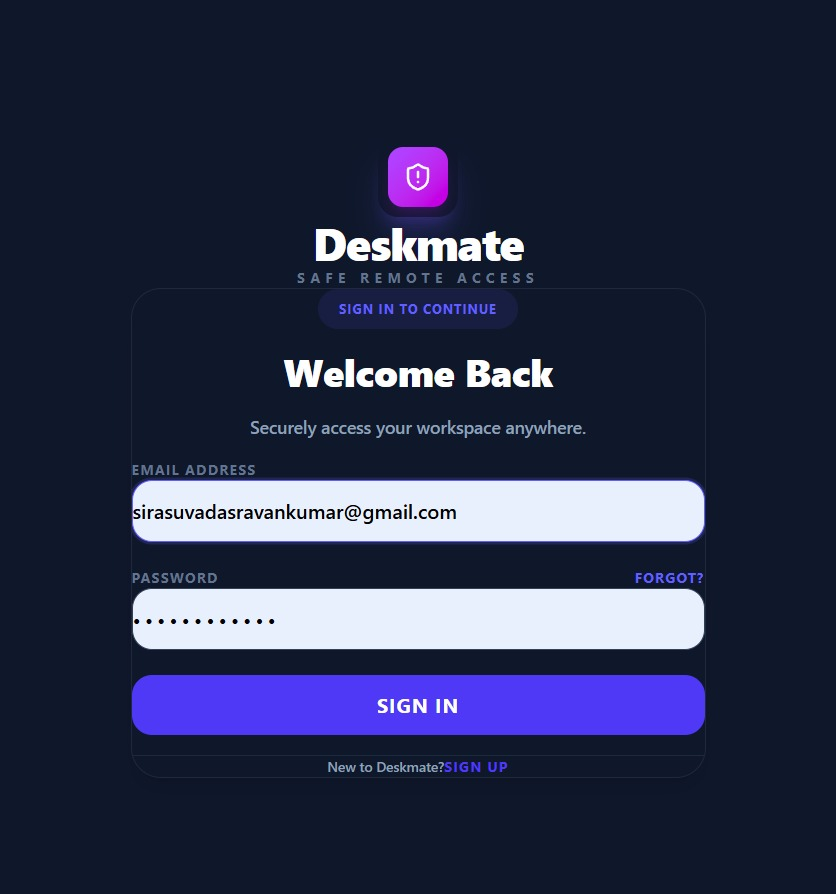
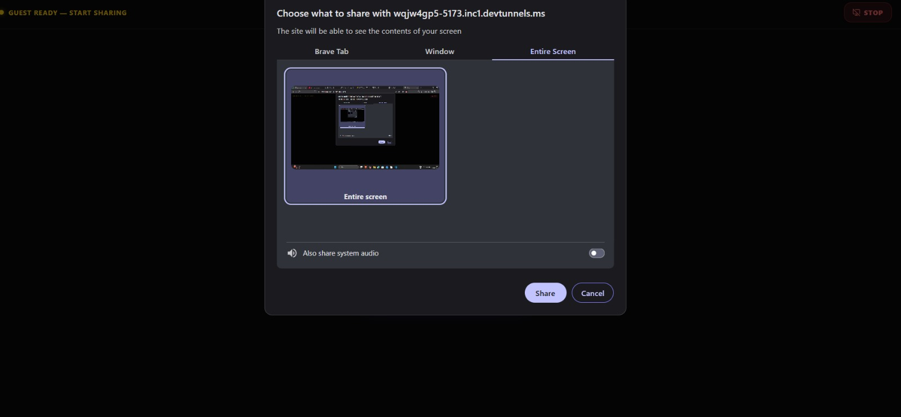
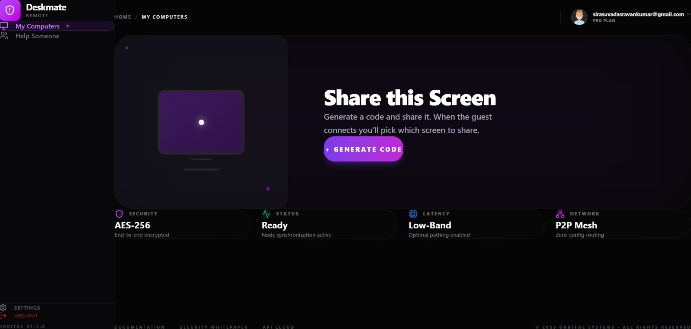
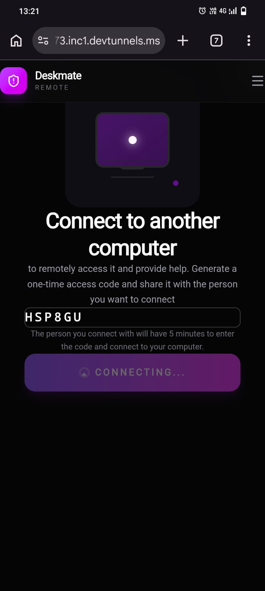
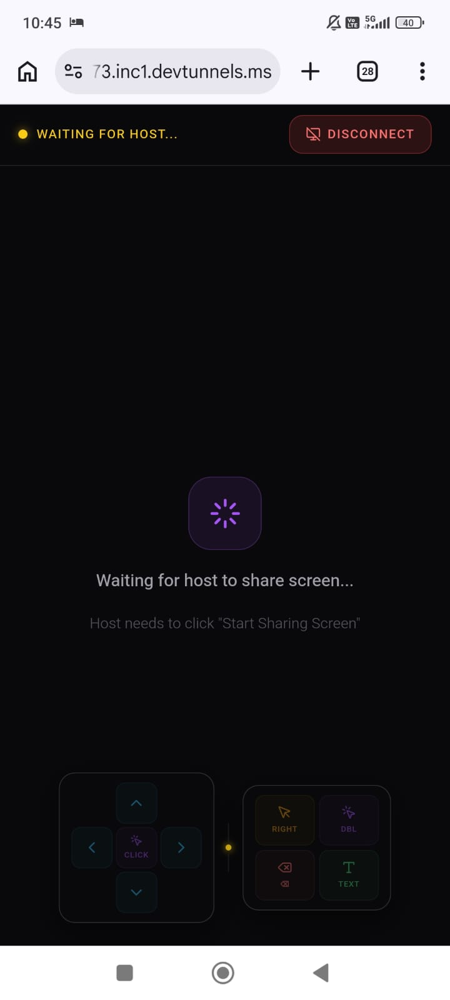
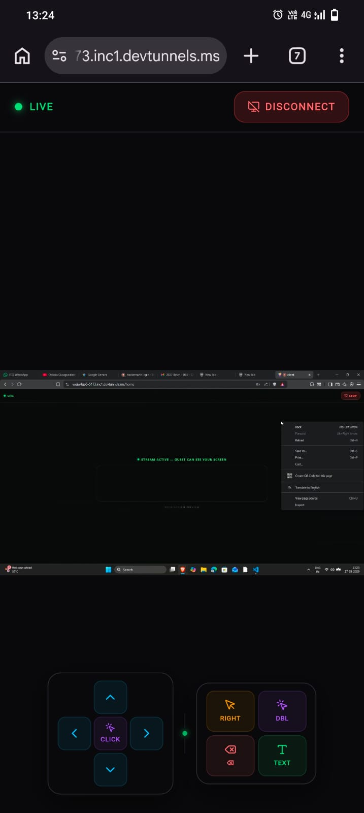
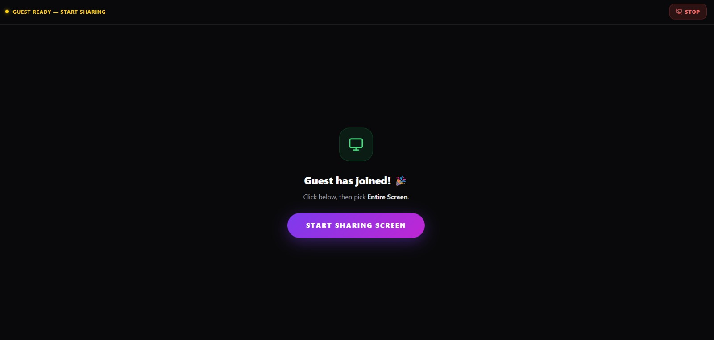

# 🚀 DeskMate – Real-Time Automation Platform

## 📌 Overview
DeskMate is a real-time automation platform built using React.js, Node.js, Express.js, and WebSockets to enable instant communication and desktop automation workflows.

The project focuses on real-time interactions, secure backend communication, and event-driven architecture.

---

## ✨ Features
- Real-time client-server communication
- Event-driven automation workflows
- Secure backend API integration
- Active session management
- Responsive frontend interface

---

## 🛠️ Tech Stack
### Frontend
- React.js
- HTML
- CSS
- JavaScript

### Backend
- Node.js
- Express.js
- WebSockets

---

## 📷 Screenshots
## 📷 Screenshots

### 🔐 Login Page

### 🖥️ Screen Sharing

### 🔗 Generating Connection Code

### ⏳ Connecting to Desktop

### ✅ Connected Successfully

### 💻 Remote Desktop View

### 🖥️ Active Desktop Session

---

## 🚀 Future Improvements
- Permanent cloud deployment
- Authentication system
- Enhanced automation controls
- Real-time monitoring dashboard

---

## 🔗 Author
Gajula Siri Chandana
Sirasuvada Sravan Kumar

GitHub: https://github.com/twinkle12006
LinkedIn: https://www.linkedin.com/in/gajula-siri-chandana
